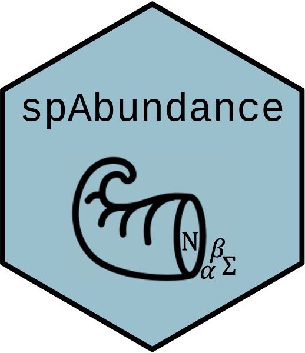

<!-- README.md is generated from README.Rmd. Please edit that file -->

# spAbundance <a href='https://www.jeffdoser.com/files/spabundance-web/'></a>

[](https://CRAN.R-project.org/package=spAbundance)
[](https://CRAN.R-project.org/package=spAbundance)
[](https://app.codecov.io/gh/doserjef/spAbundance?branch=main)

`spAbundance` fits univariate (i.e., single-species) and multivariate
(i.e., multi-species) spatial N-mixture models, hierarchical distance
sampling models, and generalized linear mixed models using Markov chain
Monte Carlo (MCMC). Spatial models are fit using Nearest Neighbor
Gaussian Processes (NNGPs) to facilitate model fitting to large spatial
datasets. `spAbundance` uses analogous syntax to its “sister package”
[spOccupancy](https://www.jeffdoser.com/files/spoccupancy-web/) (Doser
et al. 2022). Below we provide a very brief introduction to some of the
package’s functionality, and illustrate just one of the model fitting
functions. For more information, see the resources referenced at the
bottom of this page and the “Articles” tab at the top of the page.

## Installation

You can install the released version of `spAbundance` from
[CRAN](https://CRAN.R-project.org) with

``` r
install.packages("spAbundance")
```

To download the development version of the package, you can use
`devtools` as follows:

``` r
devtools::install_github("doserjef/spAbundance")
```

Note that because we implement the MCMC in C++, you will need a C++
compiler on your computer to install the package from GitHub. To compile
C++ on Windows, you can install
[`RTools`](https://cran.r-project.org/bin/windows/Rtools/). To compile
C++ on a Mac, you can install `XCode` from the Mac app store.

## Functionality

| `spAbundance` Function | Description                                                               |
| ---------------------- | ------------------------------------------------------------------------- |
| `DS()`                 | Single-species hierarchical distance sampling (HDS) model                 |
| `spDS()`               | Single-species spatial HDS model                                          |
| `msDS()`               | Multi-species HDS model                                                   |
| `lfMsDS()`             | Multi-species HDS model with species correlations                         |
| `sfMsDS()`             | Multi-species spatial HDS model with species correlations                 |
| `NMix()`               | Single-species N-mixture model                                            |
| `spNMix()`             | Single-species spatial N-mixture model                                    |
| `msNMix()`             | Multi-species N-mixture model                                             |
| `lfMsNMix()`           | Multi-species N-mixture model with species correlations                   |
| `sfMsNMix()`           | Multi-species spatial N-mixture model with species correlations           |
| `abund()`              | Univariate GLMM                                                           |
| `spAbund()`            | Univariate spatial GLMM                                                   |
| `svcAbund()`           | Univariate spatially-varying coefficient GLMM                             |
| `msAbund()`            | Multivariate GLMM                                                         |
| `lfMsAbund()`          | Multivariate GLMM with species correlations                               |
| `sfMsAbund()`          | Multivariate spatial GLMM with species correlations                       |
| `svcMsAbund()`         | Multivariate spatially-varying coefficient GLMM with species correlations |
| `ppcAbund()`           | Posterior predictive check using Bayesian p-values                        |
| `waicAbund()`          | Calculate Widely Applicable Information Criterion (WAIC)                  |
| `simDS()`              | Simulate single-species distance sampling data                            |
| `simMsDS()`            | Simulate multi-species distance sampling data                             |
| `simNMix()`            | Simulate single-species repeated count data                               |
| `simMsNMix()`          | Simulate multi-species repeated count data                                |
| `simAbund()`           | Simulate single-species count data                                        |
| `simMsAbund()`         | Simulate multi-species count data                                         |

All model fitting functions allow for Poisson and negative binomial
distributions for the abundance portion of the model. All GLM(M)s also
allow for Gaussian and zero-inflated Gaussian models. Note the two
functions for fitting spatailly-varying coefficient models are only
available for Gaussian and zero-inflated Gaussian models.

## Example usage

### Load package and data

To get started with `spAbundance` we load the package and an example
data set. We use data on 16 birds from the [Disney Wilderness
Preserve](https://www.neonscience.org/field-sites/dsny) in Central
Florida, USA, which is available in the `spAbundance` package as the
`neonDWP` object. Here we will only work with one bird species, the
Eastern Meadowlark (EAME), and so we subset the `neonDWP` object to only
include this species.

``` r
library(spAbundance)
# Set seed to get exact same results
set.seed(100)
data(neonDWP)
sp.names <- dimnames(neonDWP$y)[[1]]
dat.MODO <- neonDWP
dat.MODO$y <- dat.MODO$y[sp.names == "MODO", , ]
```

### Fit a spatial hierarchical distance sampling model using `spDS()`

Below we fit a single-species spatially-explicit hierarchical distance
sampling model to the MODO data using a Nearest Neighbor Gaussian
Process. We use the default priors and initial values for the abundance
(`beta`) and detection (`alpha`) coefficients, the spatial variance
(`sigma.sq`), the spatial range parameter (`phi`), the spatial random
effects (`w`), and the latent abundance values (`z`). We also include an
offset in `dat.MODO` to provide estimates of density on a per hectare
basis. We model abundance as a function of local forest cover and
grassland cover, along with a spatial random intercept. We model
detection probability as a function of linear and quadratic day of
survey and a linear effect of wind.

``` r
# Specify model formulas
MODO.abund.formula <- ~ scale(forest) + scale(grass) 
MODO.det.formula <- ~ scale(day) + I(scale(day)^2) + scale(wind)
```

We run the model using an Adaptive MCMC sampler with a target acceptance
rate of 0.43. We run 3 chains of the model each for 20,000 iterations
split into 800 batches each of length 25. For each chain, we discard the
first 10,000 iterations as burn-in and use a thinning rate of 5 for a
resulting 6,000 samples from the joint posterior. We fit the model using
15 nearest neighbors and an exponential correlation function. Run
`?spDS` for more detailed information on all function arguments.

``` r
# Run the model (Approx run time: 1.2 min)
out <- spDS(abund.formula = MODO.abund.formula,
            det.formula = MODO.det.formula,
            data = dat.MODO, n.batch = 800, batch.length = 25,
            accept.rate = 0.43, cov.model = "exponential",
            transect = 'point', det.func = 'halfnormal',
            NNGP = TRUE, n.neighbors = 15, n.burn = 10000,
            n.thin = 5, n.chains = 3, verbose = FALSE)
```

This will produce a large output object, and you can use `str(out)` to
get an overview of what’s in there. Here we use the `summary()` function
to print a concise but informative summary of the model fit.

``` r
summary(out)
#> 
#> Call:
#> spDS(abund.formula = MODO.abund.formula, det.formula = MODO.det.formula, 
#>     data = dat.MODO, cov.model = "exponential", NNGP = TRUE, 
#>     n.neighbors = 15, n.batch = 800, batch.length = 25, accept.rate = 0.43, 
#>     transect = "point", det.func = "halfnormal", verbose = FALSE, 
#>     n.burn = 10000, n.thin = 5, n.chains = 3)
#> 
#> Samples per Chain: 20000
#> Burn-in: 10000
#> Thinning Rate: 5
#> Number of Chains: 3
#> Total Posterior Samples: 6000
#> Run Time (min): 1.71
#> 
#> Abundance (log scale): 
#>                  Mean     SD    2.5%     50%   97.5%   Rhat ESS
#> (Intercept)   -1.7565 0.3078 -2.3898 -1.7507 -1.1726 1.0176  76
#> scale(forest) -0.1111 0.1822 -0.4706 -0.1124  0.2704 1.0459 210
#> scale(grass)   0.1925 0.1857 -0.1689  0.1946  0.5537 1.1173 236
#> 
#> Detection (log scale): 
#>                    Mean     SD    2.5%     50%   97.5%   Rhat ESS
#> (Intercept)     -2.5567 0.1140 -2.7680 -2.5600 -2.3285 1.0044 272
#> scale(day)      -0.1717 0.0847 -0.3617 -0.1666 -0.0216 1.0246 311
#> I(scale(day)^2)  0.0202 0.0867 -0.1436  0.0158  0.1991 1.0262 319
#> scale(wind)     -0.1522 0.0816 -0.3276 -0.1487 -0.0046 1.0260 575
#> 
#> Spatial Covariance: 
#>            Mean     SD   2.5%   50%  97.5%   Rhat ESS
#> sigma.sq 0.4830 0.2527 0.1734 0.425 1.1549 1.0351 252
#> phi      0.0014 0.0014 0.0003 0.001 0.0059 1.0445 188
```

### Posterior predictive check

The function `ppcAbund` performs a posterior predictive check on the
resulting list from the call to `spDS`. We provide options to group, or
bin, the data in different ways prior to performing the posterior
predictive check, which can help reveal different types of inadequate
model fit. Below we perform a posterior predictive check on the data
grouped by site with a Freeman-Tukey fit statistic, and then use the
`summary` function to summarize the check with a Bayesian p-value.

``` r
ppc.out <- ppcAbund(out, fit.stat = 'freeman-tukey', group = 1)
summary(ppc.out)
#> 
#> Call:
#> ppcAbund(object = out, fit.stat = "freeman-tukey", group = 1)
#> 
#> Samples per Chain: 20000
#> Burn-in: 10000
#> Thinning Rate: 5
#> Number of Chains: 3
#> Total Posterior Samples: 6000
#> 
#> Bayesian p-value:  0.5208 
#> Fit statistic:  freeman-tukey
```

### Model selection using WAIC

The `waicAbund` function computes the Widely Applicable Information
Criterion (WAIC) for use in model selection and assessment (note that
due to Monte Carlo error your results will differ slightly).

``` r
waicAbund(out)
#> N.max not specified. Setting upper index of integration of N to 10 plus
#> the largest estimated abundance value at each site in object$N.samples
#>       elpd         pD       WAIC 
#> -168.03803   13.45534  362.98673
```

### Prediction

Prediction is possible using the `predict` function, a set of covariates
at the desired prediction locations, and the spatial coordinates of the
locations. The object `neonPredData` contains percent forest cover and
grassland cover across the Disney Wildnerness Preserve. Below we predict
MODO densityacross the preserve, which is stored in the `out.pred`
object.

``` r
# First standardize elevation using mean and sd from fitted model
forest.pred <- (neonPredData$forest - mean(dat.MODO$covs$forest)) /
               sd(dat.MODO$covs$forest)
grass.pred <- (neonPredData$grass - mean(dat.MODO$covs$grass)) /
               sd(dat.MODO$covs$grass)
X.0 <- cbind(1, forest.pred, grass.pred)
colnames(X.0) <- c('(Intercept)', 'forest', 'grass')
coords.0 <- neonPredData[, c('easting', 'northing')]
out.pred <- predict(out, X.0, coords.0, verbose = FALSE)
```

## Learn more

The `vignette("distanceSampling")`, `vignette("nMixtureModels")`, and
`vignette("glmm")` provide detailed descriptions and tutorials of all
hierarchical distance sampling models, N-mixture models, and generalized
linear mixed models in `spAbundance`, respectively. Given the similarity
in syntax to fitting occupancy models in the `spOccupancy` package, much
of the documentation on the [`spOccupancy`
website](https://www.jeffdoser.com/files/spoccupancy-web/) will also be
helpful for fitting models in `spAbundance`.

## Citing `spAbundance`

Please cite `spAbundance` as:

Doser, J. W., Finley, A. O., Kéry, M., and Zipkin, E. F. (2023).
spAbundance: An R package for univariate and multivariate
spatially-explicit abundance models. arXiv Preprint.

## References

Doser, J. W., Finley, A. O., Kéry, M., and Zipkin, E. F. (2022).
spOccupancy: An R package for single-species, multi-species, and
integrated spatial occupancy models. Methods in Ecology and Evolution.
<https://doi.org/10.1111/2041-210X.13897>.
